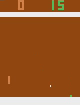

## Asynchronous Advantage Actor-Critic (A3C)

A clean implementation of the Asynchronous Advantage Actor-Critic (A3C) method as described in [Asynchronous Methods for Deep Reinforcement Learning](https://arxiv.org/abs/1602.01783v2) written in PyTorch.

* `atari_wrappers.py` contains wrappers for gym atari environments.
* `common.py` contains some common functionality.
* `data.py` contains code for the dataset.
* `envs.py` contains a simple test environment. 
* `model.py` contains multiple model definitions.
* `play.py` allows testing and visualizing previously trained models.
* `train.py` contains the main training code with the opportunity to customize hyperparameters, the game being played, the model and the ability to save and load models.

Example command for training:

`python3 train.py --env_name PongNoFrameskip-v4 --target_mean_returns 20 --checkpoint_path checkpoints --run_id testrun --n_steps 4 --n_processes 2`

Starts a training on the environment `PongNoFrameskip-v4` with 2 processes and the run_id `testrun` while 4 steps are unrolled 
for each update. Models will be saved in the folder `checkpoints` each epoch and by default also if a SIGTERM signal is received. 
The training will stop and save a final checkpoint if the mean returns over the last episodes reaches 20.

Example command for playing:

`python3 play.py --env_name PongNoFrameskip-v4 --video_path videos --model_path models/example_pong_model.tar`

Plays several episodes of the environment `PongNoFrameskip-v4` using the existing model saved in 
`models/example_pong_model.tar` while the resulting videos are saved in the `videos` folder.

&nbsp;

